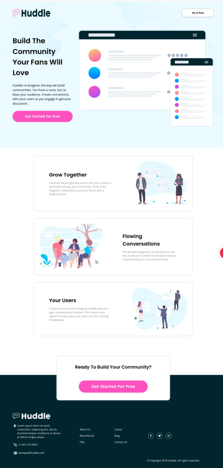

# Frontend Mentor - Huddle landing page with alternating feature blocks solution

This is a solution to the [Huddle landing page with alternating feature blocks challenge on Frontend Mentor](https://www.frontendmentor.io/challenges/huddle-landing-page-with-alternating-feature-blocks-5ca5f5981e82137ec91a5100). Frontend Mentor challenges help you improve your coding skills by building realistic projects. 

## Table of contents

- [Overview](#overview)
  - [The challenge](#the-challenge)
  - [Screenshot](#screenshot)
  - [Links](#links)
- [My process](#my-process)
  - [Built with](#built-with)
  - [What I learned](#what-i-learned)
  - [Useful resources](#useful-resources)
- [Author](#author)

## Overview

### The challenge

Users should be able to:

- View the optimal layout for the site depending on their device's screen size
- See hover states for all interactive elements on the page

### Screenshot



### Links

- Solution URL: [Wa7dany](https://github.com/Wa7dany/Frontend-mentor/tree/main/Blocks-Huddle-Landing-Page)
- Live Site URL: [Blocks Huddle Landing Page](https://wa7dany.github.io/Frontend-mentor/Blocks-Huddle-Landing-Page/blocks-huddle-landing-page.html)

## My process

### Built with

- Semantic HTML5 markup
- CSS custom properties
- Flexbox
- CSS Grid
- SASS

### What I learned
Adding aria-label and aria-hidden to tags for screen readers
```html
<a href="#" aria-label="Facebook">Facebook</a>
<a href="#" aria-hidden="true">Link</a>
```

Learned how to use filter to change svg colors

```css
.proud-of-this-css {
  filter: brightness(0) invert(100%) sepia(100%) saturate(1%) hue-rotate(43deg) brightness(102%) contrast(101%);
}
```


### Useful resources

- [CSS filter generator](https://codepen.io/sosuke/pen/Pjoqqp) - This helped me for converting the color i want the svg want to be

## Author

- Frontend Mentor - [Wa7dany](https://www.frontendmentor.io/profile/Wa7dany)
