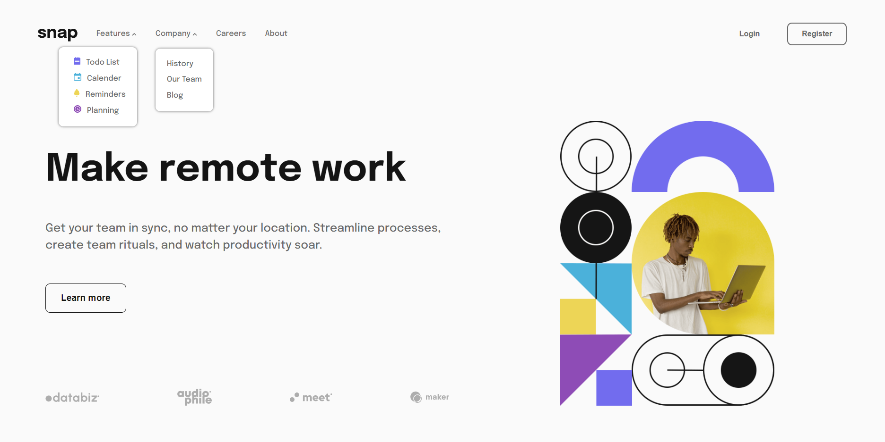

# Frontend Mentor - Intro section with dropdown navigation solution

This is a solution to the [Intro section with dropdown navigation challenge on Frontend Mentor](https://www.frontendmentor.io/challenges/intro-section-with-dropdown-navigation-ryaPetHE5). Frontend Mentor challenges help you improve your coding skills by building realistic projects. 

## Table of contents

- [Overview](#overview)
  - [The challenge](#the-challenge)
  - [Screenshot](#screenshot)
  - [Links](#links)
- [My process](#my-process)
  - [Built with](#built-with)
  - [What I learned](#what-i-learned)
- [Author](#author)


## Overview

### The challenge

Users should be able to:

- View the relevant dropdown menus on desktop and mobile when interacting with the navigation links
- View the optimal layout for the content depending on their device's screen size
- See hover states for all interactive elements on the page

### Screenshot



### Links

- Solution URL: [Challenge repo](https://github.com/Wa7dany/Frontend-mentor/tree/main/Section-With-Dropdown-Navigation)
- Live Site URL: [Section with dropdown navigation](https://wa7dany.github.io/Frontend-mentor/Section-With-Dropdown-Navigation/section-with-dropdown-navigation.html)

## My process

### Built with

- Semantic HTML5 markup
- CSS custom properties
- Flexbox
- CSS Grid
- SASS - SCSS
- JavaScript

### What I learned

Learned how to use transform property , how to use linear gradient to change color for half of the screen

learned how to use DOM events , adding classes to elements by JavaScript

```css
.proud-of-this-css {
  transform: translate(100%);
  background: linear-gradient(90deg, #FFC0CB 50%, #00FFFF 50%);
}
```
```js
const menuBtn = document.querySelector(".menu-btn");
menuBtn.addEventListener("click", function () {
  menuBtn.classList.add("open-item");
  menuBtn.classList.remove("open-item");
})
```

## Author

- Frontend Mentor - [Wa7dany](https://www.frontendmentor.io/profile/Wa7dany)
